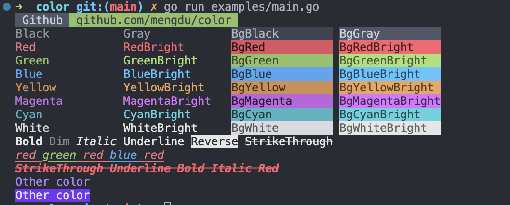

# color

Terminal output with ANSI colors in Go.



```sh
go get github.com/mengdu/color
```

```go
func main() {
  fmt.Println(color.Std.Red().String("Hello, world!"))
  fmt.Println(color.Std.Bolb().Italic().Underline().Red().String("Hello, world!"))

  c := color.New(color.EnableColor(true)) // new instance
  fmt.Println(color.Red().String("Red"))
}
```

[Examples](./examples/main.go)
